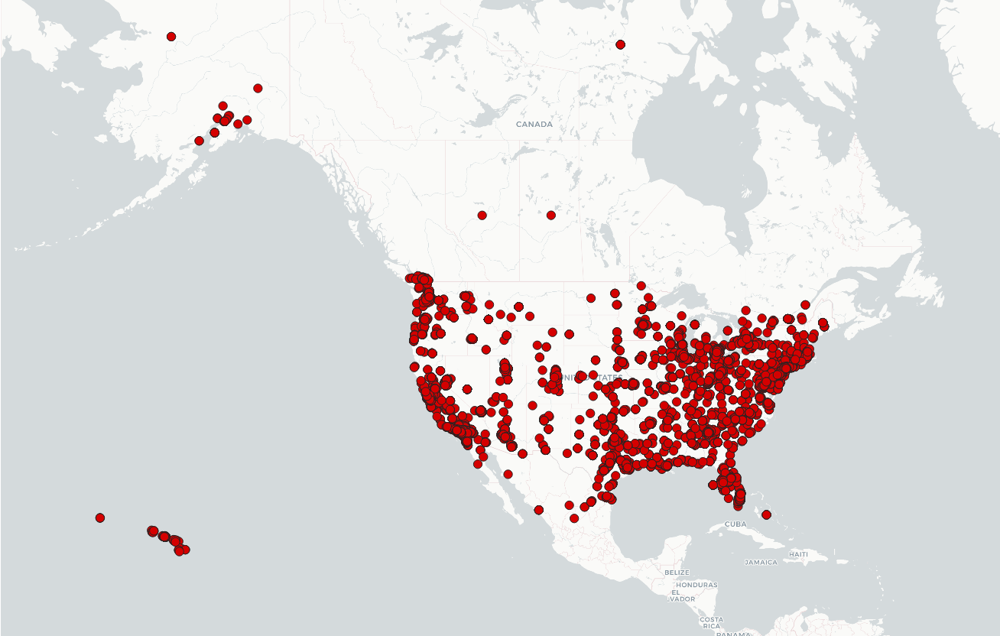
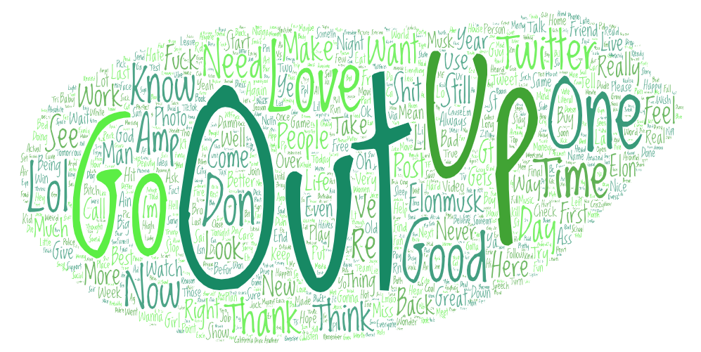
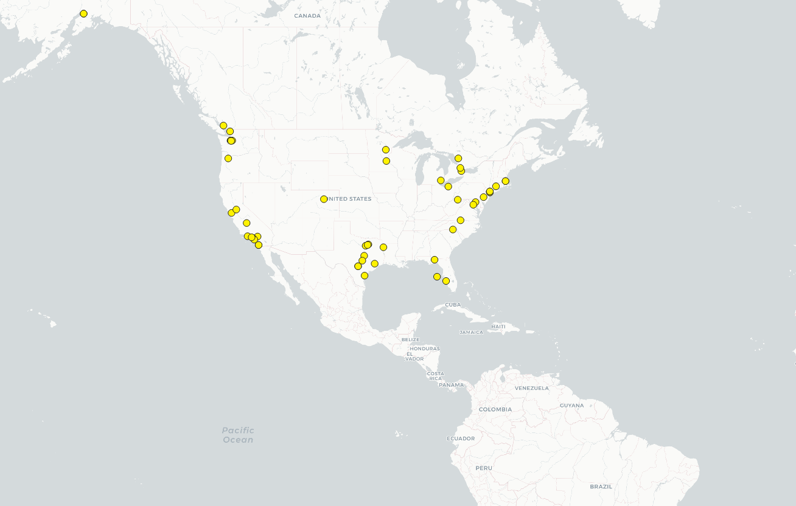
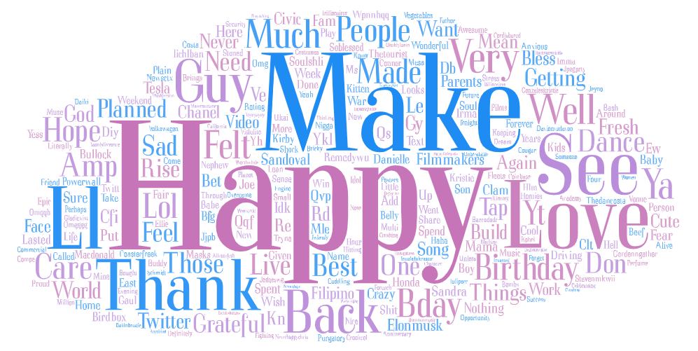

# Lab 2
In this lab, we created two different maps with different parameters. I was curious to see if a relationship between time and longitude would present itself. It seems as if there was, but it is not as significant as I would've imagined it would be. 

## First map
The first map I created was to simply to see what demographics were tweeting at 9pm PST. As XKCD has pointed out, it is largely a population map, skewed towards the west coast given that at that time, much of the east coast has gone to bed, given the time zone differences.

## Second map
The second map I've created is to explore the relationship between place and happiness. I didn't realize that this volume of data would be insufficient to get a sufficiently high resolution to see where people are the happiest, but in general, it can still be seen that most of the tweets relating to happiness are in cities. But that again may be due to the fact that most tweets are in cities to begin with.  

